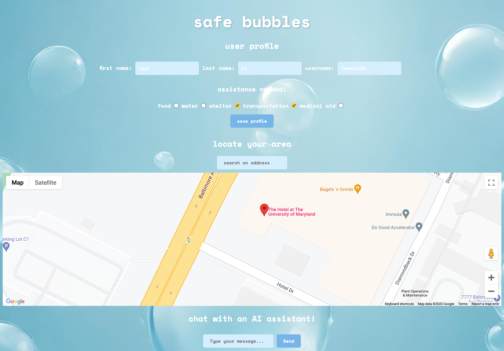

# App Idea: Safe Bubbles - Community Assistance Locator

## Problem Statement: 

During times of crisis, such as natural disasters or public health emergencies, communities often need quick access to essential resources and assistance. Many people want to help their neighbors but lack a streamlined way to offer or request assistance.

## App Concept: 

Safe Bubbles is a web app (potentially mobile) designed to facilitate community support during emergencies and times of need.

## Features:

- User Profiles: Users can create profiles with their basic information, location, and a list of assistance they can offer (e.g., food, water, shelter, transportation, medical aid).

- Request Assistance: Individuals in need can create requests for specific types of assistance. For instance, someone can request water, a place to stay, or transportation to a nearby shelter.

- View Map: A map displays user profiles, requests, and available resources. Users can see who needs help and who can provide it within their vicinity.

- AI Assitant: A chatbox connected to AI for user assistance

## To be implemented:

- Real-time Notifications: Users receive real-time push notifications when someone nearby needs assistance or offers help.

- Secure Messaging: Users can communicate securely through an in-app messaging system to coordinate assistance.

- Verification and Trust: Implement a simple user verification system to ensure the authenticity and trustworthiness of users offering help.

## Impact:

During disasters or crises, NeighborConnect can quickly connect individuals in need with nearby neighbors who can provide essential assistance.

Encourages a sense of community and mutual support during difficult times.

## Tech Stack:

- Node.js for the backend API.
- Netfily for deploying.
- Google Maps API for location and mapping features.

## Development Tasks:

- Create the user registration and profile setup.
- Implement the ability to create assistance requests.
- Design the map view to display nearby users and assistance requests.
- Set up real-time notifications and messaging.
- Develop a simple user verification system.
- Test and ensure a user-friendly interface.

